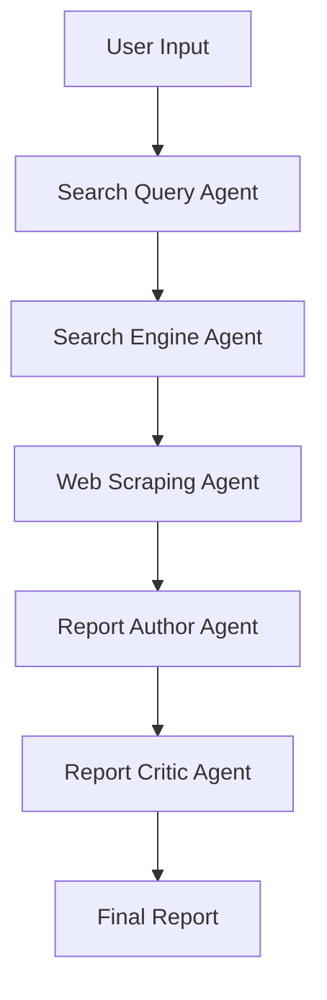

# **AI-Powered Multi-Agent Research System**
**Build Multi AI Agents and Automate Tasks with CrewAI and AgentOps !**

## Overview

An intelligent multi-agent system built with CrewAI and AgentOps that automates product research, price comparison, and procurement reporting using advanced AI agents working in coordinated workflows.

----------------------------------------------------------------------------------------------------------------------------------------------------------------
##  Key Features

**🔍 Smart Search Optimization :**

+ Intelligent Query Generation: AI-powered search query recommendations

+ Multi-Platform Search: Simultaneous search across multiple e-commerce platforms

+ Quality Filtering: Automatic filtering based on confidence scores and ratings

**📊 Advanced Data Extraction:**

+ Structured Product Data: Automated extraction of prices, specifications, and images

+ Price Tracking: Current price, original price, and discount percentages

+ Product Comparison: Side-by-side specification analysis

**📊 Professional Reporting:**

+ Automated Procurement Reports: Comprehensive market analysis

+ Quality Assurance: Multi-stage review and critique process

+ Executive Summaries: Actionable insights for decision makers

## Core Technologies

<table>
  <tr>
    <th>Technology</th>
    <th>Purpose</th>
    <th>Benefits</th>
  </tr>
  <tr>
    <td><b>🤖 CrewAI</b></td>
    <td>Multi-agent orchestration framework</td>
    <td>Sequential workflow, agent collaboration, task management</td>
  </tr>
  <tr>
    <td><b>📊 AgentOps</b></td>
    <td>Agent monitoring and analytics</td>
    <td>Performance tracking, session replay, debugging tools</td>
  </tr>
  <tr>
    <td><b>🚀 Groq</b></td>
    <td>High-speed LLM inference</td>
    <td>Ultra-fast response times, efficient processing</td>
  </tr>
  <tr>
    <td><b>📝 Pydantic</b></td>
    <td>Data validation and serialization</td>
    <td>Type safety, structured outputs, JSON schema generation</td>
  </tr>
</table>

## System Architecture

## Agent Responsibilities

<table>
  <tr>
    <th>Agent</th>
    <th>Role</th>
    <th>Output</th>
  </tr>
  <tr>
    <td>🔍 <b>Search Query Agent</b></td>
    <td>Generates optimized search queries</td>
    <td>JSON search queries</td>
  </tr>
  <tr>
    <td>🌐 <b>Search Engine Agent</b></td>
    <td>Searches across multiple platforms</td>
    <td>Filtered search results</td>
  </tr>
  <tr>
    <td>🕸️ <b>Web Scraping Agent</b></td>
    <td>Extracts product details</td>
    <td>Structured product data</td>
  </tr>
  <tr>
    <td>✍️ <b>Report Author Agent</b></td>
    <td>Creates draft procurement report</td>
    <td>Initial report draft</td>
  </tr>
  <tr>
    <td>🧠 <b>Report Critic Agent</b></td>
    <td>Quality assurance and feedback</td>
    <td>Detailed critique</td>
  </tr>
</table>

## 📊 AgentOps Monitoring Dashboard
Real-time Monitoring Features

+ 🖥️ Session Replay: Watch exact agent execution sequences

+ 📈 Performance Metrics: Track agent response times and success rates

+ 🔍 Error Analysis: Detailed error tracking and debugging

+ 📋 Agent Analytics: Individual and team performance insights

